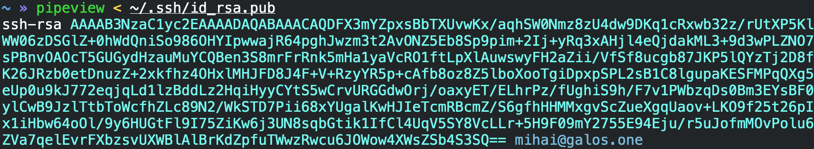
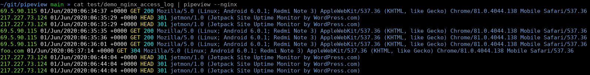

# pipeview

[](https://github.com/mihaigalos/pipeview/actions/workflows/ci.yaml)
[](https://github.com/mihaigalos/pipeview/actions/workflows/cd.yaml)
[](https://crates.io/crates/pipeview)

A command line pipe inspection utility.



## Why?

* [x] Simple coloring of an input pipe with regex and colors as input args.
* [x] Multiple custom configs in the form of a `pipeview.toml` file in current folder or `~/.config/`.
* [ ] Progress bar (same as Linux's `pv`) - WIP.

## Usage

### Simple coloring with no args
When calling pipeview with no parameters, it will search for commas in the input. If no commas are found, it will default to searching for spaces.

Whichever it finds first will serve as a delimiter for splitting the input for coloring.

Example:
```bash
```

### Explicit coloring via regex patterns
Explicit coloring can be performed on the input based on a regular expression.

```bash
$ cat test/demo_nginx_access_log | pipeview "^(.*?) - - \\[(.*?)\\] \"(.*?) .*?\" (.*?) .*? \".*?\" \"(.*?)\"" 'bgreen white yellow cyan blue'
```

### Nginx

Nginx and [aim](https://github.com/mihaigalos/aim) logs can be directly inspected using the `--nginx` or `--aim` flag:

```bash
$ cat test/demo_nginx_access_log | pipeview --nginx
```



### Custom configs

You can create a config in `~/.config/pipeview.toml` or the current folder with filename `pipeview.toml` and call it using `pipeview --config=foo`.

An example custom config could be:
```toml
[foo]
regex="^(.*?) (.*?) (.*?): (.*?) (.*)"
colors="red green blue red green"
```

In case no custom config is specified, but there is a `pipeview.toml` file in the default paths and it contains only one entry, it will be used by default.

This enables you to have the file under version control and just use `pipeview` out-of-the-box without any args.

## Installation

### Building from source

```bash
$ cargo install pipeview
```
